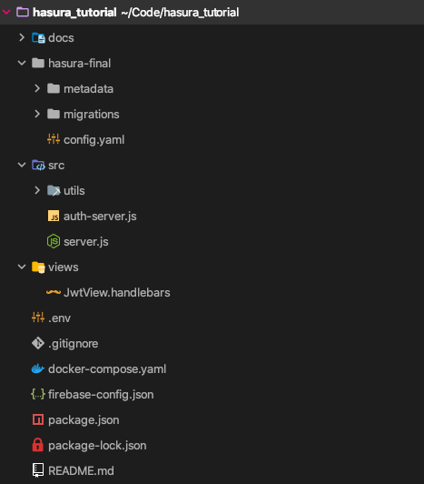
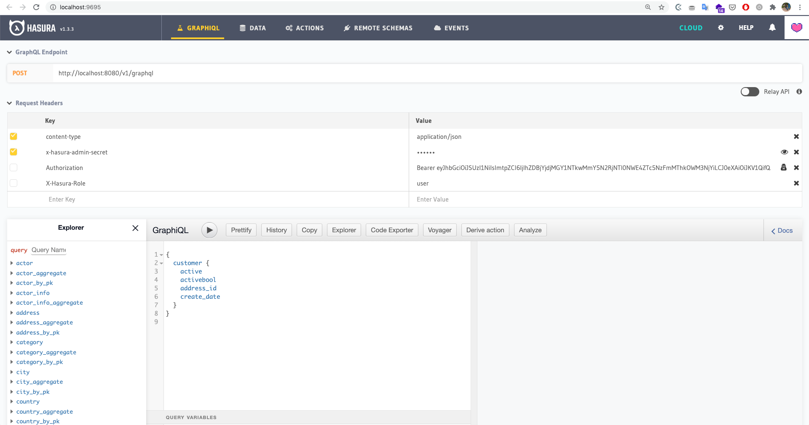

# Repository structure

## hasura-final

Folder containing the final configuration for the hasura API you will get after you completed the tutorial, you can use these settings by:
    
1. Set the environment variable `HASURA_SETTING_FOLDER` to `hasura-final` in the `.env` file
2. Run `npx hasura console --project=hasura-final`
       Then you will be redirected to the hasura console UI where you can explore and test the final API

## database
Folder with database SQL scripts to set up the database using the `pagila-schema.sql` and the `pagila-data.sql` files, this folder is filled after running the `npm run database:clone` script.

## src
Contains the source code for:
1. `auth-server.js`: Auth server in charge of generating the JSON Web Tokens (JWT) explained in the Authorization and Authentication section of the tutorial.
2. `server.js`: Express server with sample hasura trigger and actions. 

## views
Basic templates used to render the pages of the `auth-server.js` and show the JWT's.

## docker-compose
Main file to specify the docker containers that need to be setup for the tutorial. Two containers are needed, one for the postgres database and another for the hasura graphql engine.

The `sql` scripts in the `database` folder are copied to the `docker-entrypoint-initdb.d` directory of the container so as soon as the database container is ready, the database will run the script to create the schema and then fill the database.

Environment variables are used to tell the hasura container where the migrations and metadata is located via volumes as well.

## package.json
Basic `package.json` of the project, it has the following scripts:
- `start`: Runs the `auth` server to generate the JWT's, this app is deployed to heroku so it's not needed to run it locally unless you want to learn more about it
- `database:clone`: It clones or copies the Pagila database scripts to the `database` folder
- `server:start`: Starts the general server with the hasura actions and triggers explained in the tutorial
- `server:authentication:start`: Starts the auth server, it's the same as the `start` command

## firebase-config.json
Config file for the `auth-server.js` since it runs the firebase javascript SDK that it's usually used in the client applications to sign in the user and other operations, this is used to generate the sample JWT's.

## .env
This file has the environment variables used in the docker-compose file, in other words, it has the database connection details, the Hasura ports, and admin secret passwords, anytime you need to see a parameter take a look at this file.

> NOTE: Usually `.env` files shouldn't be added to a repository since they should be overwritten in the desired environment but for simplicity of this tutorial I included the file in the repository to enhance the development experience, be aware of this notice when you are building your actual project.
