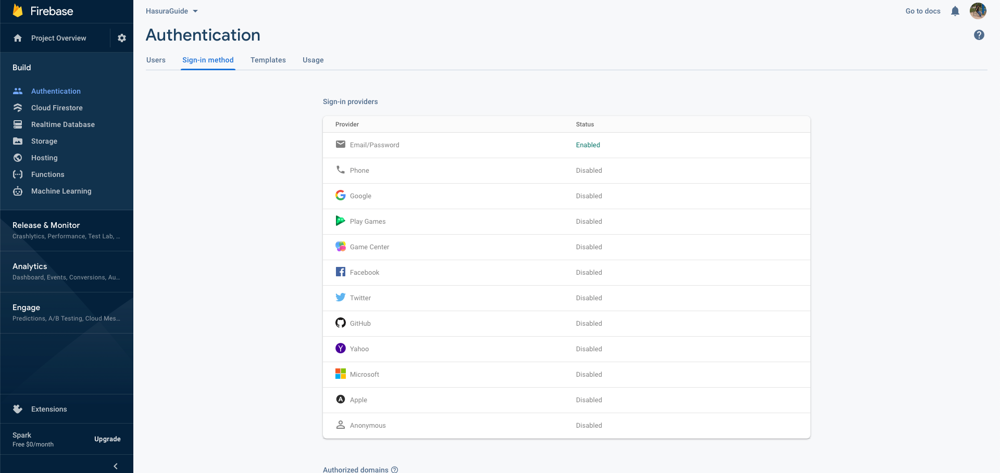
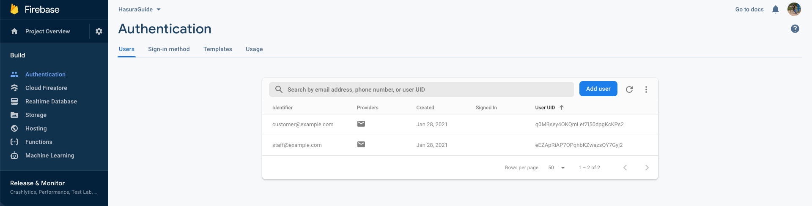
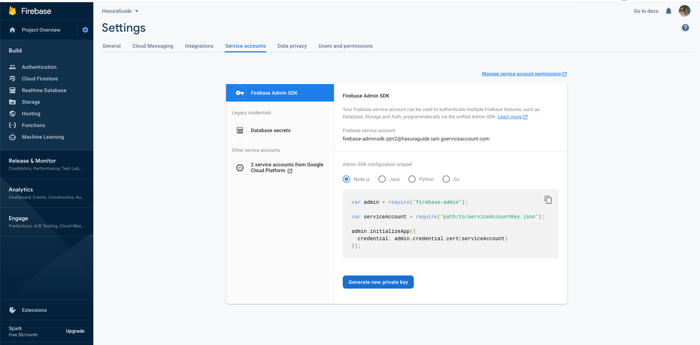
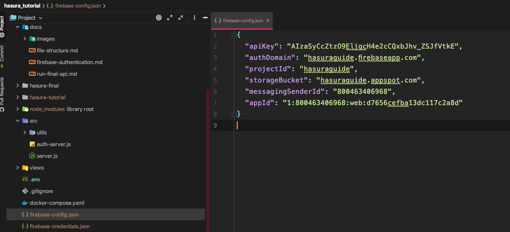
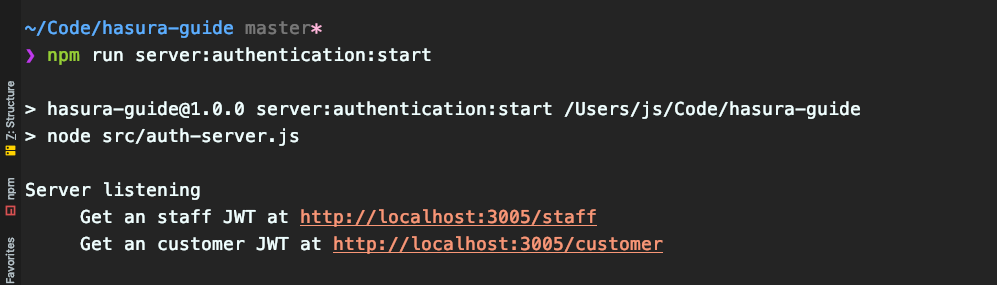
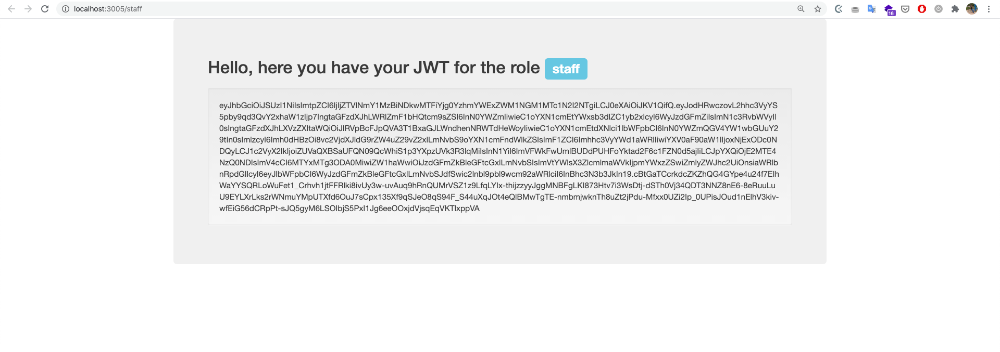
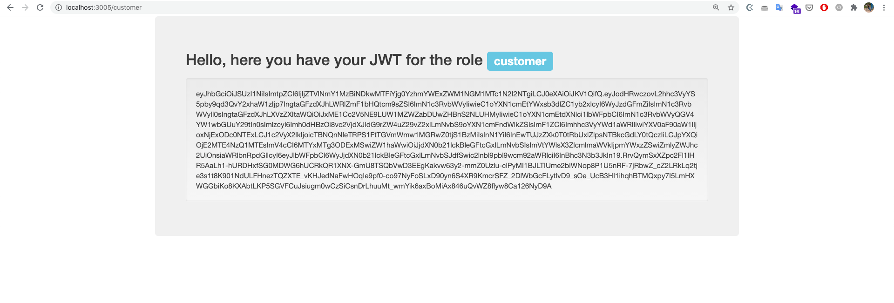

# Firebase authentication
This is how you can create your own firebase project and use it with the `auth-server.js` in this project to generate JWT's with custom roles

1. Sign up in firebase console
2. Create a new firebase project with any name you like
3. Go to the authentication section and enable `Email/Password` authentication
   
4. Go to the users sections and create 2 users
    1. Email: `staff@example.com` Password: `staff123456`
    2. Email: `customer@example.com` Password `customer123456`.
       
    This is how your users should look like:
   
5. Go to  `Project settings` > `Service accounts` > `Generate new private key`
   
6. Go to `Project settings` > `Your apps` > `Add app` then select the icon with the `</>` which means `web app`, put any name you like and copy the firebase config to a `firebase-config.json` file at the root of the project
   Your `firebase-config.json` should look like this:
   

7. You will get a JSON file, copy it in the root of the project and rename it to `firebase-credentials.json`
8. Run `npm run server:authentication:start` and you will see the following in the console

If you visit either of the URL provided you will see the following

